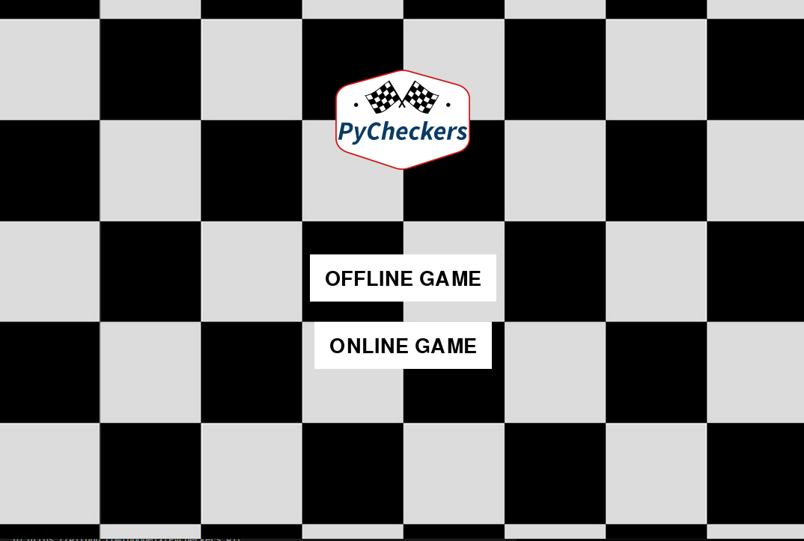

# PyCheckers
Jeu de dames developpé en Python

## Petite présentation

Présenter le projet:

PyCheckers est un jeu de dames en developpé en Python, on peut jouer contre une IA ou un joueur et comparer ses scores avec les autres joueurs.

Les fonctionnalités sans les détails :

- Jouer contre l'IA
- Jouer contre un joueur
- Comparer ses scores

Techno utilisées :

- Python
- module pygame
- module socket
- mysql


## Fix pip install mysql 

linux :
```bash
# MySQL
sudo apt-get install libmysqlclient-dev

# MariaDB
sudo apt-get install libmariadbclient-dev
```

Windows :
Il faut télécharger le 'mysql python connector' :
https://dev.mysql.com/downloads/connector/python/

## L'application :

menu principal :

 

Login/Register :

 

Choix de la couleur :

 

Jeux :

 
